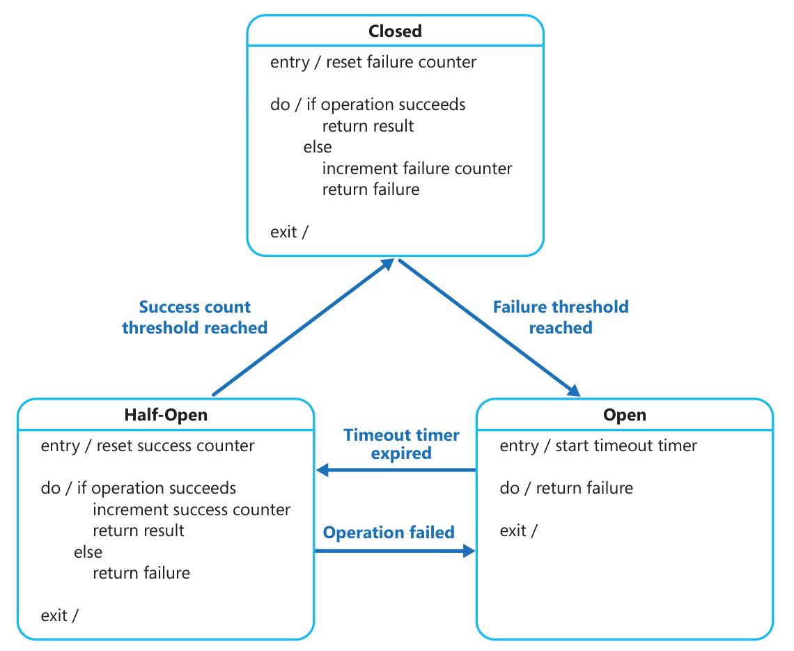

# 
Circuit Breaker

## Introduction
Handle faults that may take a variable amount of time to rectify when connecting to a remote service or resource. This pattern can improve the stability and resiliency of an application.
## Context & Problem
In a distributed environment such as the cloud, where an application performs operations that access remote resources and services, it is possible for these operations to fail due to transient faults such as slow network connections, timeouts, or the resources being overcommitted or temporarily unavailable. These faults typically correct themselves after a short period of time, and a robust cloud application should be prepared to handle them by using a strategy such as that described by the Retry Pattern.
However, there may also be situations where faults are due to unexpected events that are less easily anticipated, and that may take much longer to rectify. These faults can range in severity from a partial loss of connectivity to the complete failure of a service. In these situations it may be pointless for an application to continually retry performing an operation that is unlikely to succeed, and instead the application should
quickly accept that the operation has failed and handle this failure accordingly.
Additionally, if a service is very busy, failure in one part of the system may lead to cascading failures. For example, an operation that invokes a service could be configured to implement a timeout, and reply with a failure message if the service fails to respond within this period. However, this strategy could cause many concurrent requests to the same operation to be blocked until the timeout period expires. These blocked requests might hold critical system resources such as memory, threads, database connections, and so on. Consequently, these resources could become exhausted, causing failure of other possibly unrelated parts of the system that need to use the same resources. In these situations, it would be preferable for the operation to fail immediately, and only attempt to invoke the service if it is likely to succeed. Note that setting a shorter timeout may help to resolve this problem, but the timeout should not be so short that the operation fails most of the time, even if the request to the service would eventually succeed.
## Solution
The Circuit Breaker pattern can prevent an application repeatedly trying to execute an operation that is likely to fail, allowing it to continue without waiting for the fault to be rectified or wasting CPU cycles while it determines that the fault is long lasting. The Circuit Breaker pattern also enables an application to detect whether the fault has been resolved. If the problem appears to have been rectified, the application can attempt to invoke the operation.
    The purpose of the Circuit Breaker pattern is different from that of the Retry Pattern. The Retry Pattern enables an application to retry an operation in the expectation that it will succeed.The Circuit Breaker pattern prevents an application from performing an operation that is likely to fail. An application may combine these two patterns by using the Retry pattern to invoke an operation through a circuit breaker.However, the retry logic should be sensitive to any exceptions returned by the circuit breaker and abandon retry attempts if the circuit breaker indicates that a fault is not transient.

A circuit breaker acts as a proxy for operations that may fail. This proxy should monitor the number of recent failures that have occured & then use this information to decide whether to allow the operation to proceed or simply return an exception immediately.
The proxy maintains a count of the number of recent failures, and if the call to the operation is unsuccessful the proxy increments this count. If the number of recent failures exceeds a specified threshold within a given time period, the proxy is placed into the Open state. At this point the proxy starts a timeout timer, and when
this timer expires the proxy is placed into the Half-Open state.

The proxy can be implemented as a state machine with following states that mimic the functionality of an electrical circuit breaker:
- Closed: *When circuit breaker proxy is in closed state, request is routed to handler*
- Open: *When circuit breaker proxy is in open state, request is failed immediately.*
- Half open: *A limited # of requests are allowed to pass through and invoke operation. if these requests are successful then it is assumed fault which was causing failures earlier is fixed and circuit goes back to closed state (failure counter is reset). if request fails then circuit is put to Open state and timer restarts.*

### *Note*
    The Half-Open state is useful to prevent a recovering service from suddenly being inundated with
    requests. As a service recovers, it may be able to support a limited volume of requests until the
    recovery is complete, but while recovery is in progress a flood of work may cause the service to time
    out or fail again.

## Interaction

### Author - Rahul Chaudhary